## 手把手：使用service-principal连接Azure-Media-Service

关于相关内容解释，请参考docs文档 https://docs.microsoft.com/en-us/azure/media-services/previous/media-services-dotnet-get-started-with-aad   

**说明**： 本步骤默认我们已经有Azure订阅，并且步骤是针对Global Azure，如果是China Mooncake请仅供参考。 

### Step by Step： 

1. **登录Azure Portal，创建Media Service服务**。
    + 单击All services，在搜索框中，键入Media Service
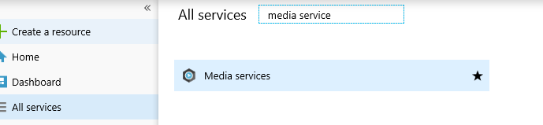
    + 单击Media Services，在Media Services，单击+ Add
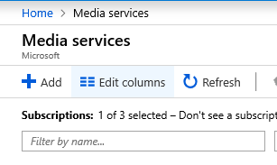
    + 输入Account Name, 选择Resource Group或创建新Resource Group，选择Location，选择Storage Account，详细信息略过...
    + 单击Create
2. **创建App**。
    + 在左侧服务列表中，单击Azure Active Directory
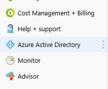
    + 选择App registrations
    + 单击New application registration
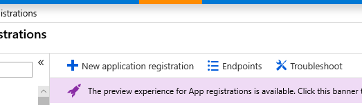
    + 输入Name， Application type选择Web app/API， Sign-on URL，随便输入一个，比如http://www.contoso.com
    + 单击Create
    + 在App registrations中， 选择刚刚创建的app
    + 记录下app的名字，Application ID等信息 (稍后，Application ID在Desktop程序中用到，它在App.config中的变量名是AMSClientId）
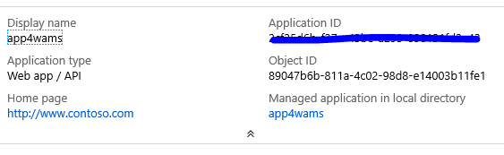
+ 单击Settings，在Settings中，选择Keys
+ 在Passwords中，键入Key Description, 比如Key1，选择duration，单击Save
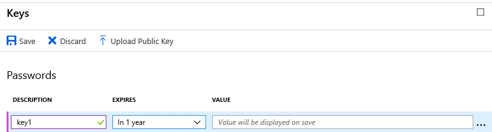
+ 保存完成以后，记录下Value的值 (稍后，这个值在Desktop程序中用到，它在App.config中的变量名是AMSClientSecret）
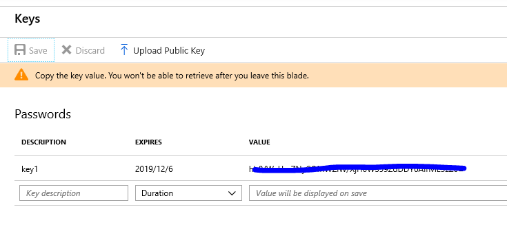
3. **配置Media Service使用service principal连接**。
    + 在All resources中，选择刚创建的media service
    + 选择API access
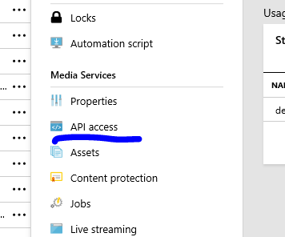
  + 单击Connect to Azure Media Services API with service principal
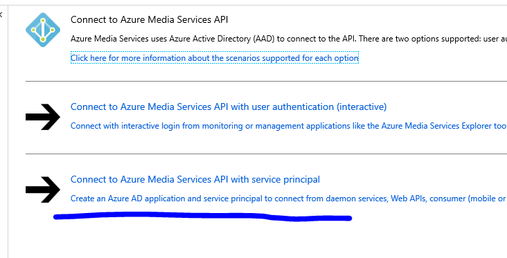
+ 记录下*Azure Active Directory tenant domain*和*REST API endpoint*的值 (稍后，这两个信息在Desktop程序中用到，它在App.config中的变量名分别是AMSAADTenantDomain和AMSRESTAPIEndpoint)
+ 在Azure AD Application中，选择Select Existing
+ 单击Azure AD app，在Azure AD applications中，输入在步骤2中记录下的app的名字
+ 选择找到的app，并单击OK
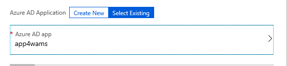
+ 在Connect to Media Services API with service principal中，单击Save
4. **创建.NET Desktop应用程序，以console Application为例，创建步骤略过**。
5. **在.NET项目中，添加引用**。
    + 右键单击项目，选择Manage NuGet Packages
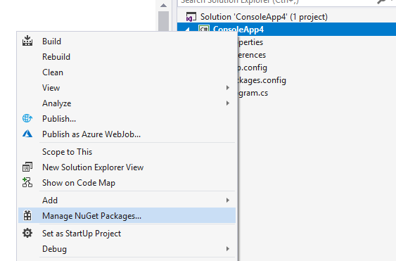
    + 在Browse中，输入windowsazure.mediaservices，单击Install
    + 右键单击References，选择Add Reference
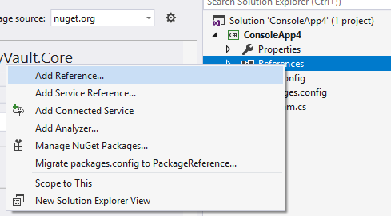
    + 搜索System.Configuration，并添加到项目中
6. **打开App.config文件，添加如下代码**
```xml
  <appSettings>
    <add key="AMSAADTenantDomain" value="{your AAD Tenant Domain}"/>
    <add key="AMSRESTAPIEndpoint" value="{your REST API Endpoint}"/>
    <add key="AMSClientId" value="{your Application ID}"/>
    <add key="AMSClientSecret" value="{your Client secret}"/>
  </appSettings>
```
**注意**： 请使用你记录下来的值替换*{ }*中的内容。
7. **打开Program.cs，添加代码**
  + 添加using引用
```Csharp
using Microsoft.WindowsAzure.MediaServices.Client;
using System.Configuration;
```
   + 定义变量
```Csharp
private static readonly string _AADTenantDomain = ConfigurationManager.AppSettings["AMSAADTenantDomain"];
private static readonly string _RESTAPIEndpoint = ConfigurationManager.AppSettings["AMSRESTAPIEndpoint"];
private static readonly string _AMSClientId = ConfigurationManager.AppSettings["AMSClientId"];
private static readonly string _AMSClientSecret = ConfigurationManager.AppSettings["AMSClientSecret"];
```
   + 定义tokenCredentials变量和tokenProvide变量
```Csharp
AzureAdTokenCredentials tokenCredentials = new AzureAdTokenCredentials(_AADTenantDomain,
                new AzureAdClientSymmetricKey(_AMSClientId, _AMSClientSecret),
                AzureEnvironments.AzureCloudEnvironment);
var tokenProvider = new AzureAdTokenProvider(tokenCredentials);
```
+ 定义CloudMediaContext对象
```Csharp
CloudMediaContext context = new CloudMediaContext(new Uri(_RESTAPIEndpoint), tokenProvider);
```
+ 至此，我们已经创建了一个CloudMediaContext对象context，可以使用这个对象来访问Media Service中的资源，对资源进行Encode，publish等操作。

### 附录代码
**App.config**
```XML
<?xml version="1.0" encoding="utf-8" ?>
<configuration>
    <startup> 
        <supportedRuntime version="v4.0" sku=".NETFramework,Version=v4.6.1" />
    </startup>
  <appSettings>
    <add key="AMSAADTenantDomain" value="{your AAD Tenant Domain}"/>
    <add key="AMSRESTAPIEndpoint" value="{your REST API Endpoint}"/>
    <add key="AMSClientId" value="{your Application ID}"/>
    <add key="AMSClientSecret" value="{your Client secret}"/>
  </appSettings>
</configuration>
```
**注意**： 请使用你记录下来的值替换*{ }*中的内容。

**Program.cs**
```Csharp
using System;
using System.Linq;
using Microsoft.WindowsAzure.MediaServices.Client;
using System.Configuration;

namespace ConsoleApp4
{
    class Program
    {
        private static readonly string _AADTenantDomain =
    ConfigurationManager.AppSettings["AMSAADTenantDomain"];
        private static readonly string _RESTAPIEndpoint =
            ConfigurationManager.AppSettings["AMSRESTAPIEndpoint"];
        private static readonly string _AMSClientId =
            ConfigurationManager.AppSettings["AMSClientId"];
        private static readonly string _AMSClientSecret =
            ConfigurationManager.AppSettings["AMSClientSecret"];
        static void Main(string[] args)
        {
            AzureAdTokenCredentials tokenCredentials = new AzureAdTokenCredentials(_AADTenantDomain,
                new AzureAdClientSymmetricKey(_AMSClientId, _AMSClientSecret),
                AzureEnvironments.AzureCloudEnvironment);
            var tokenProvider = new AzureAdTokenProvider(tokenCredentials);
            CloudMediaContext context = new CloudMediaContext(new Uri(_RESTAPIEndpoint), tokenProvider);

            var assets = context.Assets;
            foreach (var item in assets)
            {
                Console.WriteLine(item.Name);
            }
            Console.ReadLine();
            Console.WriteLine(context.StorageAccounts.First().Name.ToString());
        }
    }
}
```

