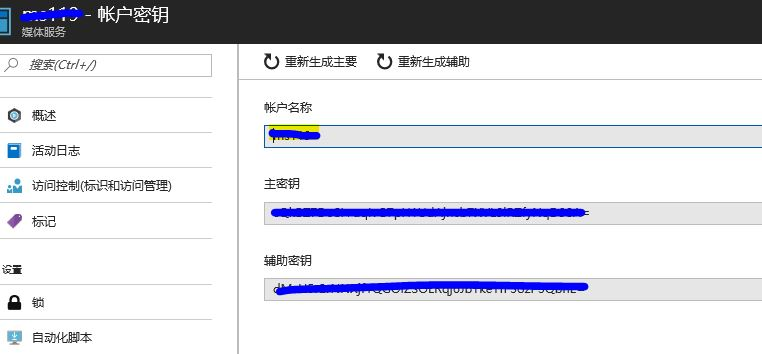

# Windows Azure Media Service_Uploader
This tool can upload the videos to azure media service, encode the video with 720p, publish and return the playable url and downloadable url.

## Download
You can download the Tool from [here](WAMS_Uploader.zip), click [View Raw](https://github.com/7788wangzi/WAMS_Uploader/blob/master/WAMS_Uploader.zip?raw=true).

## How to Use

1. Register an Azure subscription at [here](https://www.azure.cn/).
2. Create a Windows Media Service Account, get the Account Name and Account Key.

3. Update the configuration file（AMS_UPLOAD.exe.config） in the tool.   
**NOTE:** Change the Value of MediaServiceAccountName and MediaServiceAccountKey to your own.

4. Run the tool by **WAMS_UPLOAD.exe**.
5. Add the folders which contains the video files(mp4).  

6. Click **Process MP4 Files**.  

7. Once complete, there will be a .csv file in each folder.  

Azure Media Service服务链接已强制使用Service Principal, 请参考[Accessing WAMS with Service Principal](./1-use-service-principal-wams.md)
